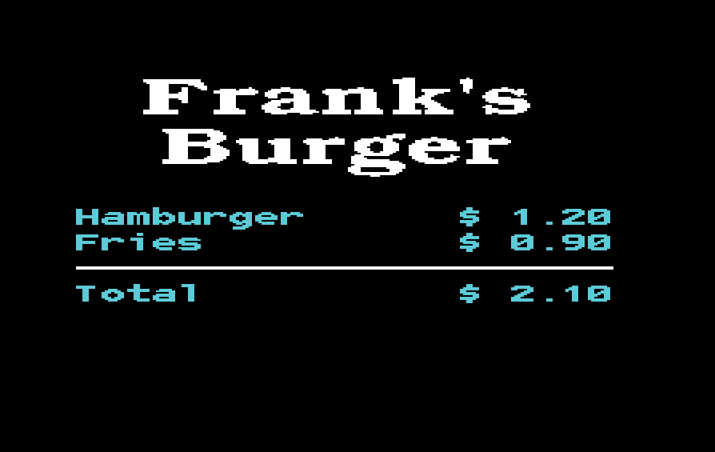

# 8x16 font test program for the VIC20
This program uses the 8x16 font from [here](https://robey.lag.net/2020/02/09/bizcat-bitmap-font.html)
and shows this, when started on a VIC20:

The double.prg file can be built with the build.sh script with CC65.
